# DDF Experiment Results

We have run a variety of simulation where we test out different strategies for the LSST deep drilling fields.  Here's a quick look at some of the relevant results, and a call for more analysis.

All of the simulations should include the four fields that have been announced by the project. In addition, some simulations have a 5th field DD:290 while the rest have Euclid deep field pointings. 

For all of these, DDFs are dithered nightly up to 0.7 degrees. The final dithering strategy is still to be decided and will depend on the on-sky performance on the telescope. We plan to customize the dithering strategy to avoid bright stars and provide more continuous coverage of the Euclid area.

Here is a brief summary of the simulations:

## baseline

DD:290 is the 5th field, DDF's are about 8% of the total visits, the u-filter is only mounted around new moon.

u-band deep field sequence is separate from other filters.

DDF sequence only executes if all the requested filters for the sequence are mounted.

## euclidddf

The Euclid DDF fields are the 5th field, DDFs are about 8% of the total visits, the u-filter is only mounted around new moon.

u-band deep field sequence is separate from other filters

## agnddf

Based on the AGN cadence white paper. Fewer overall observations taken at a higher cadence.

## flexddf

Now we have u-band observations taken in the same sequence as other filters. DDF sequences execute with whichever filters are available. DDFs make up 5% of all observations

## flexddf_moreu

Similar to flexddf, but we leave the u filter mounted until the moon is 40% illuminated.

## longseasonddf

Similar to flexddf, but the hour angle limits on the DDFs are expanded to facilitate longer observing seasons.

## darkddf

Similar to flexddf, but now required to execute DDF sequences only in dark time. 

Unfortunatly, the Euclid DDF was configured differently in this one, so they are listed as two fields DD:EDFS1 and DD:EDFS2

## descddf

Based on the DESC cadence white paper. Uses DD:290 as the 5th field.  

# Results

## Number of Observations

The number of observations taken of each field as a function of simulation

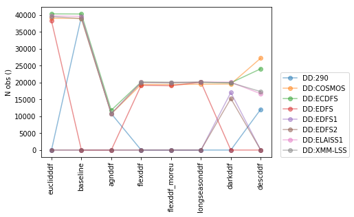

## Depths

The final coadded depths for each DDF in each simulation. As expected, since the agnddf takes many fewer exposures, it has shallower depths.  There is a significant hit to the final u filter depth if they are not forced to be taken in dark time (e.g., flexddf and longseasonddf).

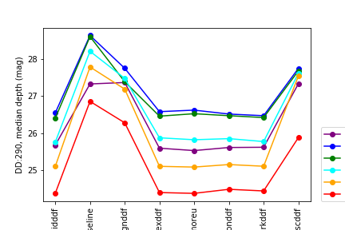
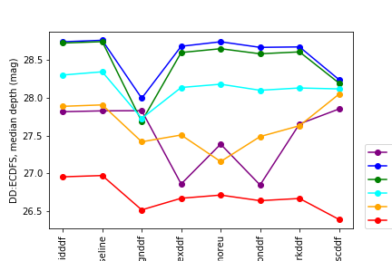
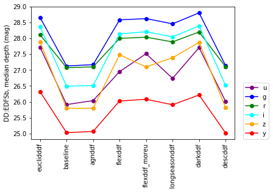
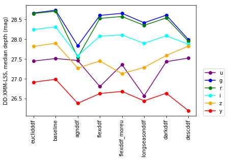
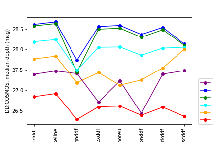
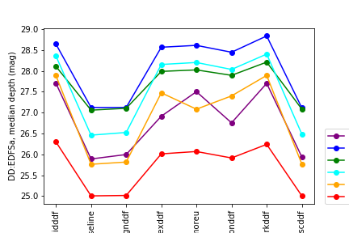
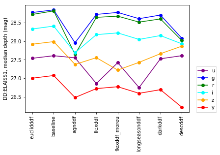

## Impact on Main Survey

We look at the median depths reached in the primary survey.  As expected, the simulations where the DDFs take more time have slightly shallower main surveys.  

The g and r filters go slightly deeper, and the z is more shallow when the u-filter is left mounted longer (u-band observations are often paired with g or r, so somewhat expected).

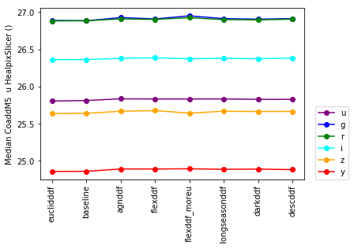
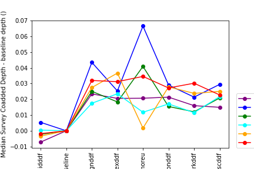

## SNe

We distribute a sample of SNe inside each DDF and see how well they are detected pre-peak, and what fraction can be considered "well-observed".

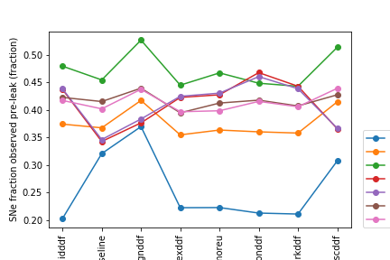
The agnddf and descddf simulations do slightly better at detecting SNe pre-peak. The DD:290 field is not included in all the simulations (and I think is not in the WFD area), so it can fall to low values. The Euclid fields EDFSa and EDFSb are in the WFD area, so even in simulations where they are not DDFs, the SNe detection rate is rather high.

We also include a metric of what fraction of our simulated population is "well-observed". This shows relatively little variation, so is probably a sign that the metrics is poorly defined.
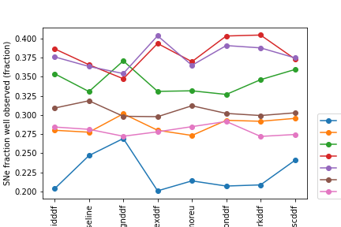

# A Call For More Metrics

The above plots show we don't have any particularly compelling metrics at the moment to determine a preferred DDF strategy. Metrics ideas 

* More rigorous SNe metrics (DESC is running some, it would be nice to try them in the MAF pipeline)
* AGN science metrics
* Perhaps a photo-z metric, so we can test how the relative filter depths effect science
* Any others?

